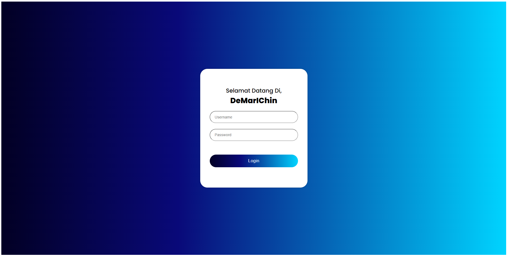
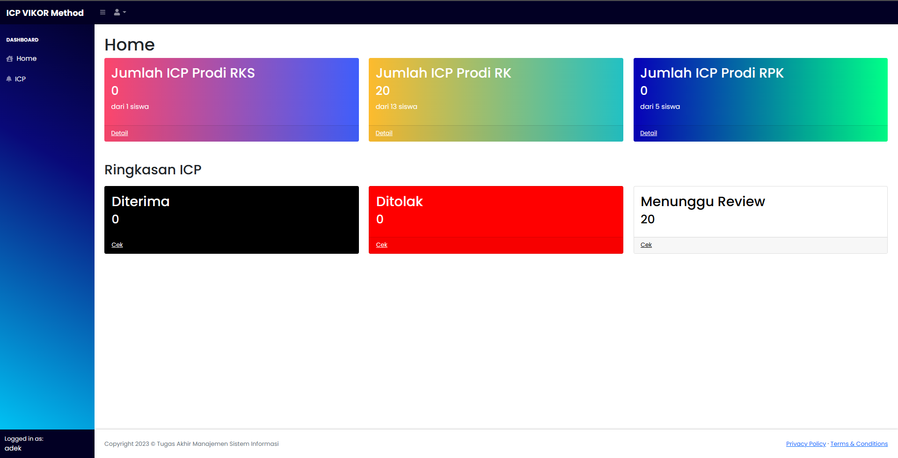
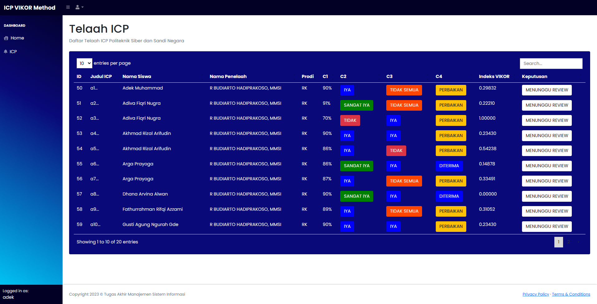
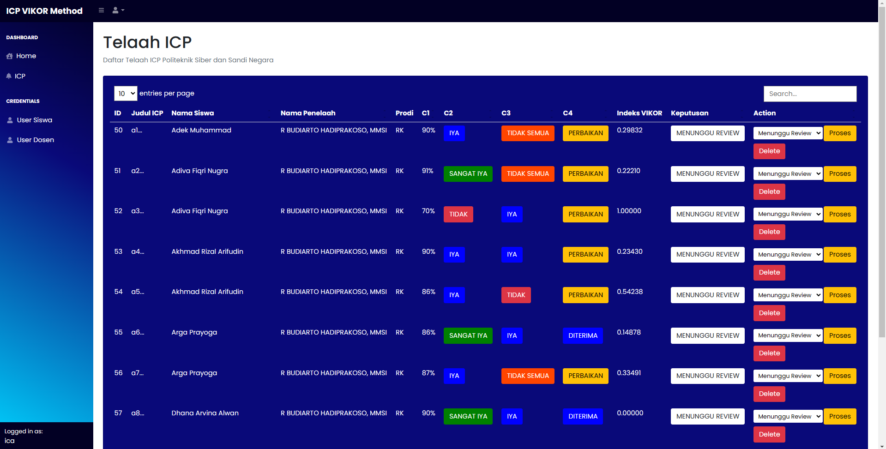
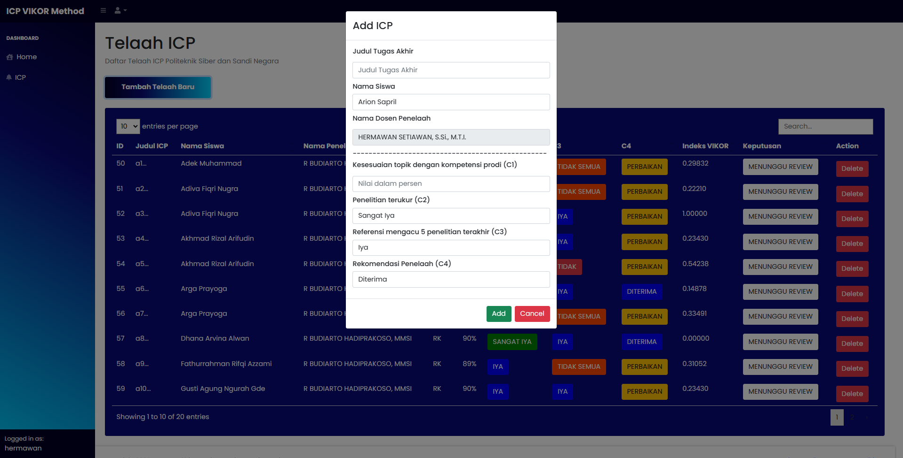

# DeMarIChin - Decision Making ICP Machine ☕️
:star: Star Us on Github - it helps!
<div align="center">

<p></p>
<a href="https://github.com/adekmzrk/DeMarIChin"></a>
<a href="https://www.instagram.com/adekmzrk/"></a> 
<a href="http://badges.mit-license.org"></a> 

</div>

**Decision Making ICP Machine** atau **DeMarIChin** merupakan sebuah sistem informasi berbasis website yang diciptakan untuk mengimplementasikan metode Vikor dalam penerimaan ICP TA Poltek SSN. Aplikasi website DeMarIChin dibuat menggunakan bahasa pemrogaman PHP dan HTML, serta untuk database menggunakan MySQL.

Aplikasi **DeMarIChin** diciptakan untuk memberikan kemudahan dan transparansi pada pihak Program Studi maupun penyelenggara pendidikan dalam menentukan penerimaan ICP TA milik mahasiswa di Poltek SSN.


### ⚡️ Role yang terdapat di aplikasi ini adalah : 
 - Taruna 
 - Dosen
 - Program Studi

### Requirements 🔧
Persyaratan yang dibutuhkan untuk menggunakan aplikasi DeMarIChin adalah :
 - XAMPP (versi 3.3.0 atau versi terbaru).
 - PHP versi 5.6 atau terbaru
 - Teks Editor (disarankan : Visual Studio Code, Sublime)
 - Web Browser

### Instalasi 🔨
1. Clone atau download source code
    - Pada terminal, clone repo `git clone git@github.com:adekmzrk/DeMarIChin.git`
    - atau `git clone https://github.com/adekmzrk/DeMarIChin.git`
    - Jika tidak menggunakan Git, silakan **Download Zip** dan *extract* pada direktori web server (misal: xampp/htdocs)
2. Buat **database baru pada mysql** untuk aplikasi ini dengan nama "icp"
3. Import database "icp menggunakan file `icp.sql`
4. Pergi ke `db/koneksi.php' lalu edit host, username, dan password sesuai dengan milik kalian, defaultnya seperti ini:
    ```php
    $DATABASE_HOST = 'localhost';
    $DATABASE_USER = 'root';
    $DATABASE_PASS = '';
    ```
5. Selesai 

### Dokumentasi 📸
</img>
</img>
</img>
</img>